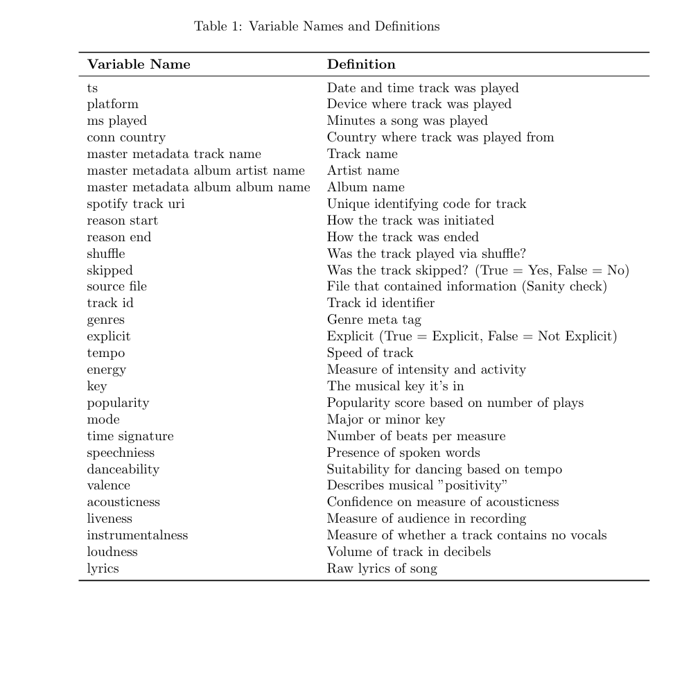
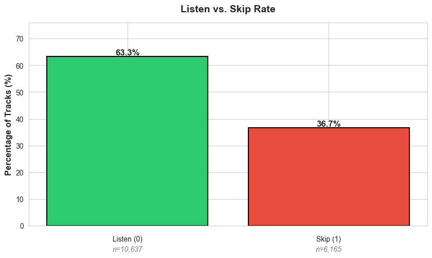
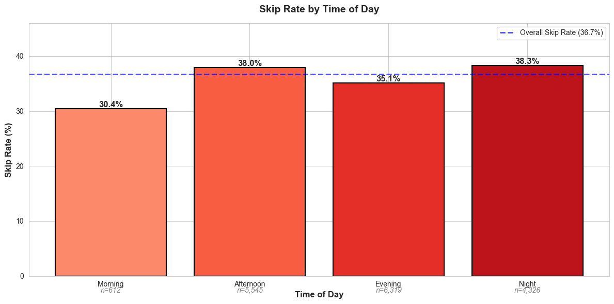
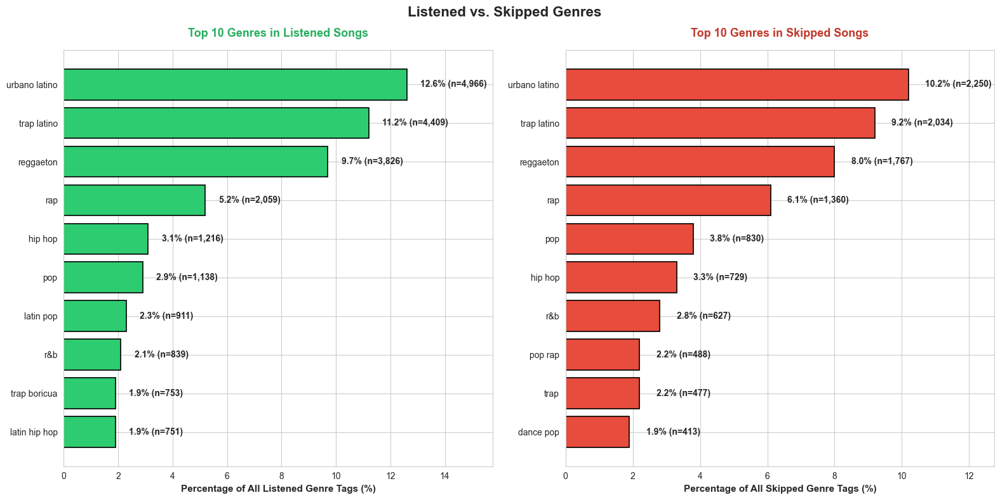
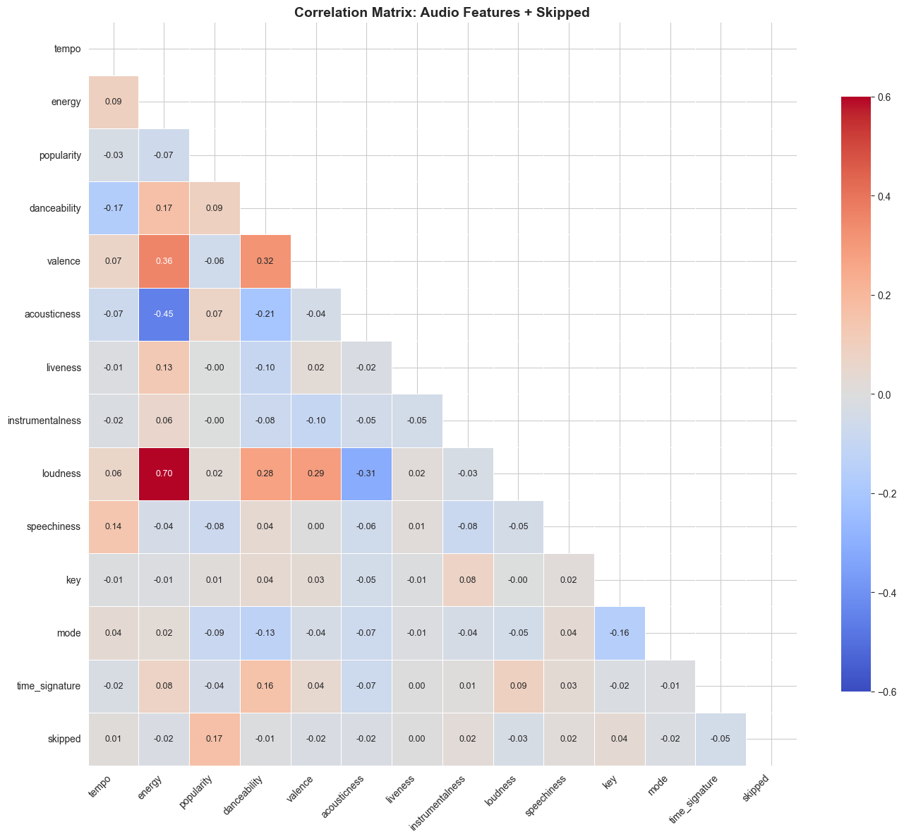

## Introduction

Streaming platforms rely on their algorithms to compete for listeners' attention. Understanding skip patterns can reduce listener mismatches generated from the algorithm. This has direct implications to the streaming economy, as it informs playlist creation, user retention and the recommendation of content.

Spotify's algorithm uses a hybrid mix of collaborative filtering and content-based filtering to curate user's listening experience. They'll present content that users with similar tastes consume, and examine a user’s own granular preferences based on audio features. A feature that is not frequently explored is the semantic content within the songs themselves.

For this study, I will develop and evaluate thee prediction models - Elastic Net Logistic Regression, XGBoost, and LSTM - to determine the effect that semantic content has on skip prediction accuracy. I will examine the features that best predict skip patterns, as well as how the order of tracks affects this. Below are the results.
 
## Methodology

**Data Acquisition**

Using the "Download your data" feature in Spotify, I requested and aquired my listening data history, spanning from 2013 to 2025. 

To increase the complexity of the dataset, I gathered the audio features (for ex. energy, key, tempo) of the songs in my history from kaggle datasets. In addition, I web scraped the lyrics to each song from the AZlyrics website.

**Model Selection**

The dataset I'm using high-dimensional (+100 columns when inlcuding TDIF toakens), and contains varied categorical and numerical data types. Both Elastic Net Logistic Regression and XGBoost were selected because they can both address this. LSTM will be used to look at temporal 

- **Elastic Net:** A linear model that handles feature selection through it's L1 and L2 regularization. Any irrelevant features will have their coefficient reduced or remove altogether. A key advantage is the interpretability of the coefficients, which reveals the direction of the relationship between the features and the likelihood of a skip event.  

- **XGBoost:** features an ensemble of decision trees that optimizes through gradient boosting. It is effective finding non-linear relationships between different data types. It also has built-in handling of class imbalance through scale_pos_weight.

- **LSTM:** Long Short Term Memory Networks (LSTM) is a recurrent neural network model that will look at sequences of songs within a session and find patterns leading to a skip. It excels at modeling temporal events.

**Lyrics vs. No Lyrics Model Variants**

Each model (Elastic Net, XGBoost, and LSTM) was trained twice with distinct feature set to compare the performance changes with and without the lyrical features.

- **With Lyrics:** Audio features + top 100 lyric tokens + temporal/genre features
- **Without lyrics:** Audio features + temporarl/genre features only

Audio features include information on genre, wether track is explicit, tempo, energy, key, mode, and time signature. 

## Data Overview

<!-- -->

The listening history dataset contains over 174,400+ rows and 30 columns of data. Our target variable is “skipped”, which indicates if a track was skipped. A “True” value indicates a skip event, while “False” indicates a listening event.

## Data Exploration

<!-- -->

There is a significant class imbalance, which can pose problems. If this isn’t addressed, the model will be better at predicting listens than skips. I’ll need to use a custom weight to penalize the model for misclassifying a skip. This will cause the model to work harder to learn patterns that separate skips from listens.

<!-- -->

Both the number of songs played and the number of skips significantly increase after morning time. This suggests possible listening fatigue or changes in music preferences throughout the day.

I also noticed that I’m more satisfied with my listening choices in the morning (30.4%), while I’m most selective at night (38.3%)

<!-- -->

There is a large representation of Urbano Latino, Trap Latino, and Reggaeton on both listens and skips. They are played more often than skipped.

For genres like Pop, R&B, Rap, and Hip Hop, their skip rates are higher than their listen rate, showing greater selectivity.

<!-- -->

Popularity has a weak positive correlation (+0.17) with skipping. Which means that this listening profile is one that leans towards deeper cuts or less popular tracks. It is the strongest correlation. Overall however, all correlations are weak.

Looking at correlations among the features, Energy and Loudness have a strong positive correlation (+0.70) - since they measure similar aspects. As Energy goes up, so does Loudness. Valence and Danceability also have a positive relationship (+0.32). Energy and Acousticness have a moderate negative relationship (-0.45).

## Preprocessing 

**General Preprocessing**

- **Missing Information:** Due to difficulty in sourcing audio features, genres, and lyrics for the multi-lingual (English, Spanish, Portuguese) and instrumental tracks, I excluded songs with missing data. This filtering process resulted in a 58% reduction in the training set.
- **Clean Text:** I created and implemented functions to fix mojibake characters and remove accents. This helped standardize words and lyrics and avoid errors in artist name matching when web scraping.
- **AZLyrics Name Standardization:** Artist names were changed to match the naming convention in the AZLyrics URL. This was addressed through a dictionary (for ex. “The Weeknd” was changed to “weeknd” and “Beyonce” to “beyonceknowles”) to map these names to the proper format on AZlyrics.
- **Audio Feature Scaling:** Applied standard scaler to all audio features to address different scales across variables.

**NLP Prepocessing**

- **Tokenization:** Lyrics were broken down into single text units.  
- **Clean Text:** To remove high number of text noise such as adlibs and vocalizations that are common in pop and urban records, I created my own preprocessing dictionary to remove non-information tokens.
- **Vectorization:** I vectorized the lyrics to get a count of how common tokens across the dataset. To carefully and meaningfully extract tokens, I capped the number of words to 100 features.

## Feature Engineering

- **Time Stamps:** Timestamps were broken down into categorical bins (Morning, Afternoon, Evening, Night) and were one-hot encoded to get more context into when songs were played.
- **Genre:** Genre was also one-hot encoded. To reduce the number of columns, I kept the top 20 genres that appeared most frequently; every other genre was labeled as “other”.

## Modeling

- **Elastic Net Logistic Regression:** The Elastic Net models were constructed via the saga solver, which supports the Elastic Net Regression penalty.The convergence was set high (max_iter=5000) to ensure it can handle the high dimension of the dataset. The parameter clas_weight = ‘balance’ was applied to adjust the weights proportionally for the “Skip” class.
- **XGBoost:**  The XGBoost models used were created using the binary:logistic objective function. I set a custom scale_pos_weight by providing it with the ratio of skips and listens from the skipped column.  Similar to the elastic model, this parameter penalizes the model if it predicts a skip incorrectly, forcing the model to prioritize learning what leads to a skip. 
- **LSTM:** A 20-minute threshold was used to define a session. This accounts for any temporal gaps from the removal of rows with missing track data. A 5-song sliding window was selected based on the average session length in the dataset. Both parameters would provide enough context to capture fatigue patterns and any audio changes. Sessions with fewer than 3 songs were removed as they offered little information. 

## Results

**Model Performance**

[Insert Picture]

The inclusion of lyrics made marginal improvements at best across models. 
- The Elastic Net model showed improvements in accuracy (+2.65%), precision (+3%), and F1-score (+0.01%).
- The XGBoost and LSTM models, however, were negatively impacted in most metrics, suggesting that the lyrics introduced noise and did not improve predictability.

Overall, the XGBoost models had the highest performance across both feature sets, achieving highs in accuracy (~67%), recall (70-72%), and f1-score (61-62%). 
- The Tree-boost ensemble method likely performed superior feature selection and could capture complex relationships over the Elastic Net and LSTM models.
- Another observation is the poor performance of LSTM. This suggests that on-the-spot song features, rather than temporal patterns, provide greater insight into music skips.

**Feature Importance - XGBoost**

[Insert Picture]

In the XGBoost model, 9 out of 15 important features are genre tags. This tell us that genre is the most important predictor of skip behavior.
- There is a strong theme of latin music (latin pop, trap latino, etc.) that rank high in importance.
- Some lyric tokens (perreo, mil, tamo) appear in the top 15. Overall, lyrics have less importance than genre. 
- Popularity, ranked 12th, is the only audio feature that appears in the list.

**Elastic Net Coefficients**

[Insert Picture]

Examining the coefficients generated by the Elastic Net in descending order, we observe that 13 of the 15 variables are lyric tokens. Unlike XGBoost, there are only two genre metatags, in the list. No audio features make an appearance.

Listens:
- Songs that include spanish slang such as tamo (-2.10), perreo (-1.32), and tacata (-0.86) are less likely to be skipped.
- Translation: “Tamo” = “we are” (hype up phrase), “perreo” = grind/dancing, “tacata” = common ad-lib.  
- The genre tags that show up are latin pop and trap triste. These also show up on the XGBoost model

Skips:
- Songs that contain materialistic lyrics like cash (+1.22), or youth (+1.07) are likely to lead to a skip. 

Lyric Nuance:
- Within a listening session, songs with perreo are less likey to lead to a skip compared to the word cash even though they both appear often in urban genres.

**Listen Patterns - LSTM**
 
 Below we'll observe 5 song listening sequences in both LSTM (with Lyrics and without them) to examine changes in the 5 key features it deems important (Reggaeton Genre Tag, Energy, Tempo, Hour, and Explicit).

Lyric + Audio LSTM:
 
[Insert Picture]

Pattern 1 - Possible Semantic Fatigue

In this session from the audio & lyric model, we can see a low energy and tempo session that gradually increases all the way to song E. 

Outside of energy and tempo and decline, it’s difficult to find a standout pattern.
It’s possible there is some underlying semantic fatigue that needs investigation.

Insight: Lyrical content may not always improve predictive accuracy but can provide important context and nuance that audio features alone can’t distinguish.

Audio-Only LSTM:

[Insert Picture]

Pattern 2 - Genre Fatigue

In this 2pm listening sequence, we see that:
- After 3 consecutive reggaeton tracks (songs 2,3,4) and a switch to a non-reggaeton track (song E), a skip action occurs.
- It’s likely that genre fatigue took place even with variety in energy and tempo. Genre diversity in this context, mattered more than audio quality.

Insight: After 3 consecutive tracks from reggaeton, insert a different listening palette.

[Insert Picture]

Pattern 3 - Inconsistent Vibe

This 2am listening session lacks consistency in genre, and energy. 
- Genre goes from reggaeton to other to reggaeton to other to reggaeton
- Energy starts low (-0.65) to high (0.46) to low (-.75) to mid (0.13) to low (-0.76)

Insight: Given that it’s a late night session, some consistency is needed. Commit to a genre for 2-3 songs.

[Insert Picture]

Pattern 4 - Energy is Key

Energy starts moderate (0.25, 0.44) but then declines sharply forms song 3 (-0.45) to song 4 (-1.62)

- Tempo also declines throughout the session (-0.24 to -0.60 to -0.77 to -1.56)
- Despite switching to a high energy (0.90) and high tempo (0.92) on Song E, it leads to a change in song.

Insight: Mix up the energy of the listening session after 2 low energy songs.

**Summary of XGBoost & Elastic Net Results**
- XGBoost identified genre as the strongest predictor of skip behavior,with 9 of the 15 top features being genre tags. 
- Genre Preferences lean towards latin and latin urban songs. Model prioritized genre before evaluating other characteristics.
- Elastic Net prioritized lyrical tokens. Lyrics that contained party (perreo, tacata)  over materialistic (cash, young) themes were less to result in a skip action.
- Divergence between XGBoost and Elastic feature sets were likely in the way that they handle feature selection. 
- Audio features had very little predictive power. Only popularity appeared in top rankings.

**Summary of LSTM Results**
- Analysis of lyrics adds nuance to skip prediction.
- After 3 songs of the same genre, switch to another palette.
- Consistency in audio choice is important during late night listening sessions.
- Switch up the vibe after 2 low energy tracks.

## Recommendations

## Limitations

